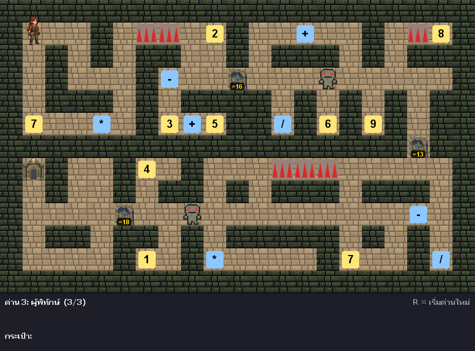

# เขาวงกตตัวเลข (Number Maze)

Mini project วิชา Object-Oriented Programming — เกมเขาวงกตที่ต้องแก้สมการคณิตศาสตร์เพื่อเปิดประตู เขียนด้วยภาษา Java (Swing)

**ผู้จัดทำ:** 6804062611033 นายวัชรเศรษฐ์ ว่องรัตน์วานิช



## เนื้อเรื่อง

นักสำรวจติดอยู่ในเขาวงกตลึกลับ ซึ่งแต่ละเส้นทางถูกปิดกั้นด้วย "ประตูรหัสผ่าน" วิธีเดียวที่จะผ่านไปได้คือการแก้สมการให้ถูกต้อง ผู้เล่นต้องเดินสำรวจเพื่อเก็บตัวเลขและเครื่องหมายที่กระจายอยู่ในด่าน แล้วนำมาจัดเรียงเพื่อปลดล็อกเส้นทางสู่ทางออก

## วิธีเล่น

| ปุ่ม | การทำงาน |
|---|---|
| `W` `A` `S` `D` หรือ ลูกศร | เดิน |
| `R` | เริ่มด่านใหม่ |
| `Enter` | เล่นใหม่หลังจบเกม |

- เดินทับตัวเลข/เครื่องหมายเพื่อเก็บเข้ากระเป๋า
- เดินชนประตูภารกิจ แล้วกดไอเทมเรียงเป็นสมการให้ได้ผลลัพธ์ตามเป้าหมาย
- ระบบคำนวณตามลำดับความสำคัญทางคณิตศาสตร์จริง (คูณ/หาร ก่อน บวก/ลบ) เช่น `3 + 2 * 4 = 11`
- ไอเทมที่ใช้ในสมการที่ถูกต้องจะหายไป ต้องวางแผนการใช้ให้ดี
- ระวังกับดักหนามและผู้พิทักษ์ ถ้าโดนจะถูกส่งกลับจุดเริ่มต้น
- ผ่านประตูชัยของด่านสุดท้ายเพื่อรับข้อความ **YOU SURVIVED!**

### ด่าน

| ด่าน | อุปสรรค | ขนาด |
|---|---|---|
| 1: ห้องฝึกหัด | ไม่มี | 15 × 11 |
| 2: ทางหนาม | กับดักหนาม | 15 × 11 |
| 3: ผู้พิทักษ์ | หนาม + ผู้พิทักษ์ลาดตระเวน | 21 × 13 |

## วิธีรัน

ต้องมี Java JDK 17 ขึ้นไป

```bash
javac -encoding UTF-8 *.java
java Main
```

หรือเปิดโฟลเดอร์นี้ใน VS Code แล้วกด Run ที่ `Main.java` (ต้องรันจากโฟลเดอร์โปรเจกต์ เพื่อให้หาโฟลเดอร์ `images/` เจอ)

## โครงสร้างคลาส

```
GameObject (abstract)
├── Player                  มี Inventory (Composition)
├── Item (abstract)
│   ├── NumberItem
│   └── OperatorItem
├── Door (abstract) ──────── implements Interactable
│   ├── PuzzleDoor          เปิดหน้าต่าง PuzzleDialog
│   └── ExitDoor            จบด่าน
└── Obstacle (abstract)
    ├── Spike               หนามโผล่-หดเป็นจังหวะ
    └── Guard               เดินลาดตระเวนซ้าย-ขวา

GamePanel (extends JPanel)  ลูปเกม, รับปุ่ม, วาดหน้าจอ
Level / Levels              อ่านแผนที่จากข้อความ / เก็บข้อมูลทุกด่าน
PuzzleDialog (extends JDialog)
ExpressionEvaluator         คำนวณสมการตามลำดับความสำคัญ
Inventory, Sprites, Main
```

## แนวคิด OOP ที่ใช้

- **Encapsulation** — field เป็น `private`/`protected` เข้าถึงผ่าน getter เช่น `Inventory.getItems()` คืน list แบบอ่านอย่างเดียว, `Door.unlock()` เป็น `protected`
- **Inheritance** — `Player`, `Item`, `Door`, `Obstacle` สืบทอดจาก `GameObject`
- **Abstraction** — abstract class `GameObject`, `Item`, `Door`, `Obstacle` และ interface `Interactable`
- **Polymorphism** — `door.interact(...)`, `obstacle.update(...)`, `item.draw(...)` แต่ละคลาสทำงานต่างกัน
- **Composition** — `Player` มี `Inventory`, `Level` มี `Item`/`Door`/`Obstacle`, `GamePanel` มี `Level` และ `Player`

## เครื่องมือที่ใช้

Java 25 (Swing, Java2D, ImageIO) · VS Code · Git / GitHub · Python + Pillow (สร้างภาพพื้น/กำแพง/ผู้พิทักษ์)
